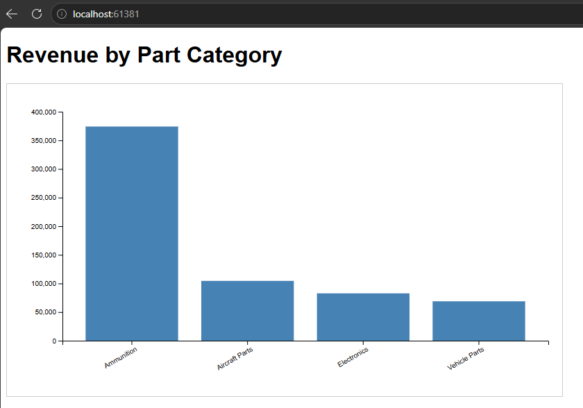

# Module 4 Programming Assignment  
## D3.js Analytics Dashboard with SQL Server Backend

### Overview
This project implements a full-stack data analytics pipeline using a Node.js/Express backend, a SQL Server relational database, and a D3.js-based frontend visualization. The system demonstrates how structured data stored in an RDBMS can be exposed through a REST API and transformed into interactive visual insights using a client-side analytics library.

---

## Chosen API and Database System

### **Data Analytics API: D3.js**
D3.js (Data-Driven Documents) is a JavaScript library for producing dynamic, interactive data visualizations in the browser. It was selected because:
- It requires no external cloud services or authentication.
- It integrates directly with REST endpoints.
- It provides full control over SVG rendering and data transformations.

### **Database System: Microsoft SQL Server**
SQL Server was chosen for its:
- Strong relational integrity
- Mature T-SQL query engine
- Compatibility with the `mssql` Node.js driver
- Ease of local development using SSMS

The database contains four tables:
- `Customers`
- `Parts`
- `Orders`
- `OrderItems`

A dataset of 20 customers, 50 parts, 30 orders, and 100 order items was generated to support meaningful analytics.

---

## Setup Instructions
### **1. Clone the Repository**
git clone <your-repo-url>
cd Module4_Backend

### **2. Install Backend Dependencies**
cd server
npm install

### **3. Configure Database Connection**
Edit `config.js`:

export const dbConfig = {
  user: "sa",
  password: "YOUR_PASSWORD_HERE",   // placeholder
  server: "localhost",
  database: "Module4_Inventory",
  options: {
    trustServerCertificate: true
  }
};

### **4. Create the Database Schema**
Use SSMS to run the provided SQL schema file:
Creates all tables
Inserts sample dataset
Recalculates order totals

### **5. Start the Backend Server**
npm start
Backend runs at:
http://localhost:3000

### **6. Start the Frontend Server**
cd ../frontend
npx serve .
Frontend runs at:
http://localhost:5000

---

## Code Examples

### **1. Backend API Endpoint**
Retrieves aggregated revenue by category:
app.get("/api/revenue-by-category", async (req, res) => {
  try {
    const result = await pool.request().query(`
      SELECT p.category,
             SUM(oi.quantity * p.unit_price) AS total_revenue
      FROM OrderItems oi
      JOIN Parts p ON oi.part_id = p.part_id
      GROUP BY p.category
      ORDER BY total_revenue DESC;
    `);
    res.json(result.recordset);
  } catch (err) {
    res.status(500).json({ error: "Internal server error" });
  }
});

### **2. D3.js Visualization**
Fetches API data and renders a bar chart:
d3.json("http://localhost:3000/api/revenue-by-category").then(data => {
  data.forEach(d => d.total_revenue = +d.total_revenue);

  const x = d3.scaleBand()
    .domain(data.map(d => d.category))
    .range([0, innerWidth])
    .padding(0.2);

  const y = d3.scaleLinear()
    .domain([0, d3.max(data, d => d.total_revenue)])
    .range([innerHeight, 0]);

  g.selectAll(".bar")
    .data(data)
    .enter()
    .append("rect")
    .attr("class", "bar")
    .attr("x", d => x(d.category))
    .attr("y", d => y(d.total_revenue))
    .attr("height", d => innerHeight - y(d.total_revenue))
    .attr("width", x.bandwidth());
});

Project Structure
Module4_Backend/
 ├── server/
 │     ├── server.js
 │     ├── config.js
 │     ├── package.json
 │     └── node_modules/
 └── frontend/
       └── index.html
Author
Kandice E.
SSE 665 – Spring 2026